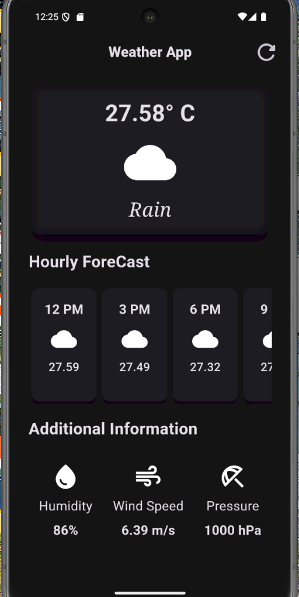
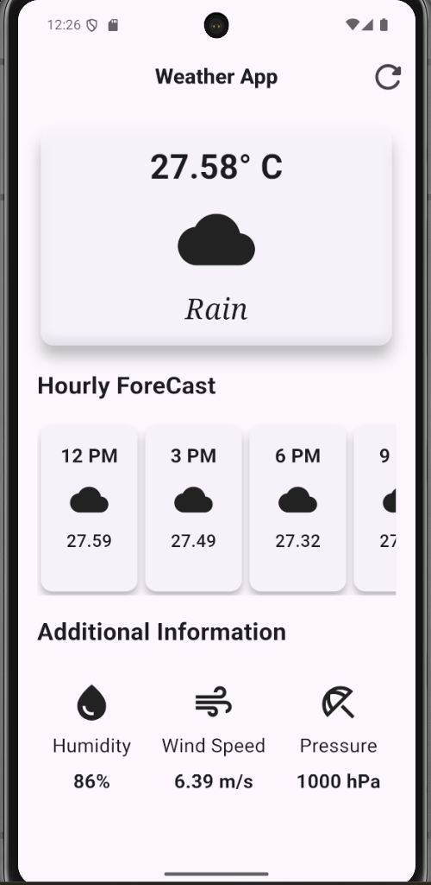

# Weather App

A beautiful and modern Flutter application that displays current weather, hourly forecasts, and additional weather information for a given city using the OpenWeatherMap API.

---

## ✨ Features

- **Current Weather:** Displays temperature, sky condition, and weather icon for the selected city (default: Surat).
- **Hourly Forecast:** Horizontally scrollable cards showing the next 8 hours of forecast.
- **Additional Information:** Shows humidity, wind speed, and pressure.
- **Pull-to-Refresh:** Instantly refresh weather data.
- **Modern UI:** Clean, Material 3 design with dark theme.

---

## 📱 Screenshots


---

## 🚀 Getting Started

### Prerequisites
- [Flutter SDK](https://flutter.dev/docs/get-started/install) (>=3.8.1)
- An API key from [OpenWeatherMap](https://openweathermap.org/api)

### 1. Clone the repository
```bash
git clone https://github.com/your-username/weather_app.git
cd weather_app
```

### 2. Install dependencies
```bash
flutter pub get
```

### 3. Set up environment variables
Create a `.env` file in the root directory:
```env
open_Weather_API_Key=YOUR_OPENWEATHERMAP_API_KEY
```
> **Note:** The `.env` file is included in `.gitignore` and should not be committed.

### 4. Run the app
```bash
flutter run
```

---

## 🛠️ Project Structure

```
lib/
  main.dart                # App entry point
  weather_screen.dart      # Main UI and logic for weather display
  hourly_focus_item.dart   # Widget for hourly forecast cards
  additional_info_item.dart# Widget for additional info (humidity, wind, pressure)
  secrets.dart             # Loads API key from .env
```

---

## 📦 Dependencies
- [flutter_dotenv](https://pub.dev/packages/flutter_dotenv) - For environment variable management
- [http](https://pub.dev/packages/http) - For making API requests
- [intl](https://pub.dev/packages/intl) - For date/time formatting
- [cupertino_icons](https://pub.dev/packages/cupertino_icons) - iOS style icons

---

## 🧪 Testing
Basic widget test is included in `test/widget_test.dart`. Run tests with:
```bash
flutter test
```

---

## 🤝 Contributing
1. Fork the repository
2. Create your feature branch (`git checkout -b feature/YourFeature`)
3. Commit your changes (`git commit -am 'Add some feature'`)
4. Push to the branch (`git push origin feature/YourFeature`)
5. Open a Pull Request

---

## Acknowledgements
- [OpenWeatherMap](https://openweathermap.org/) for the weather API
- [Flutter](https://flutter.dev/) for the awesome framework
